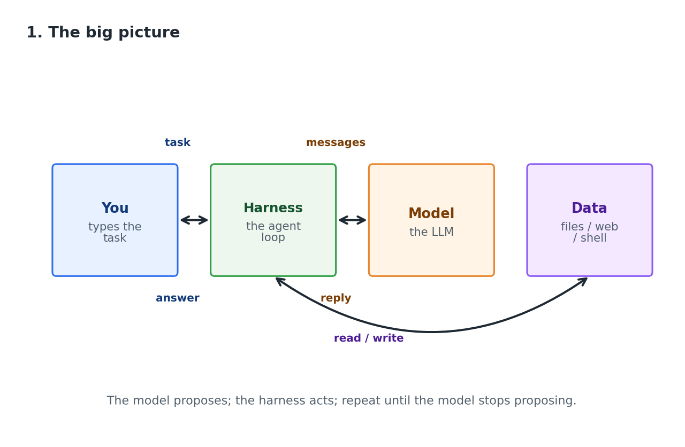
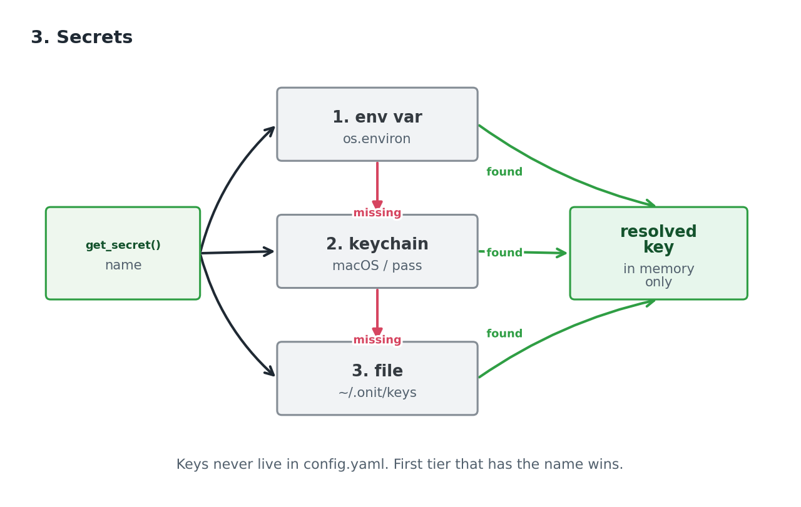
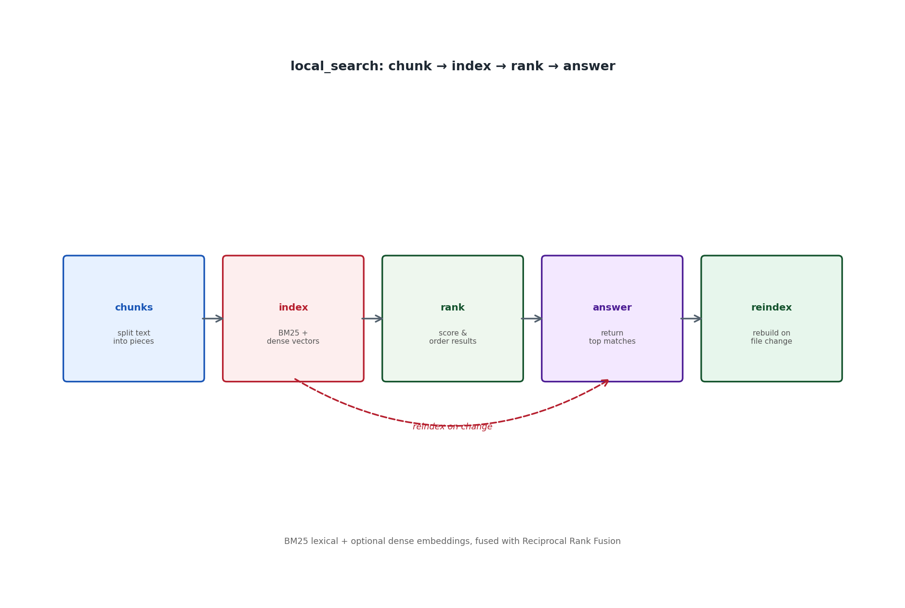
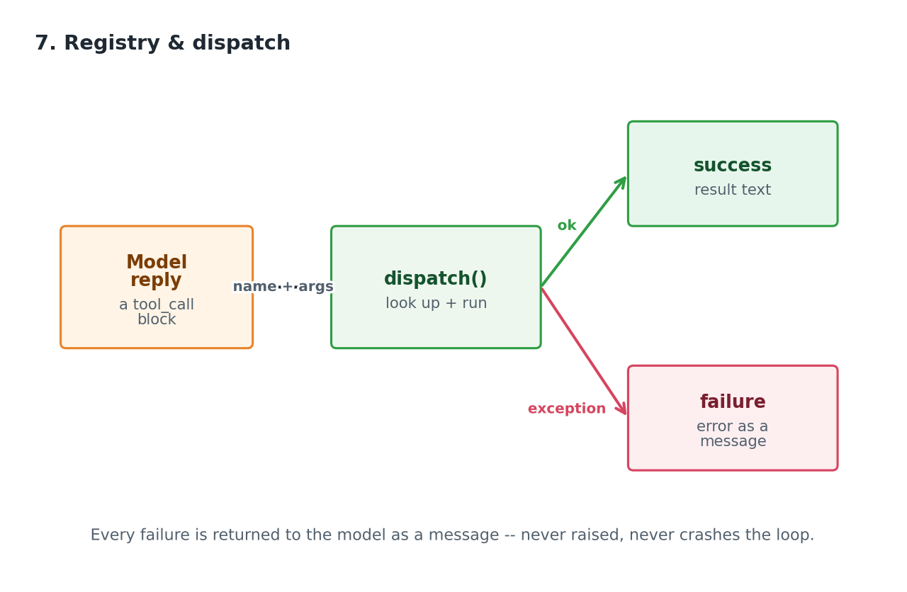
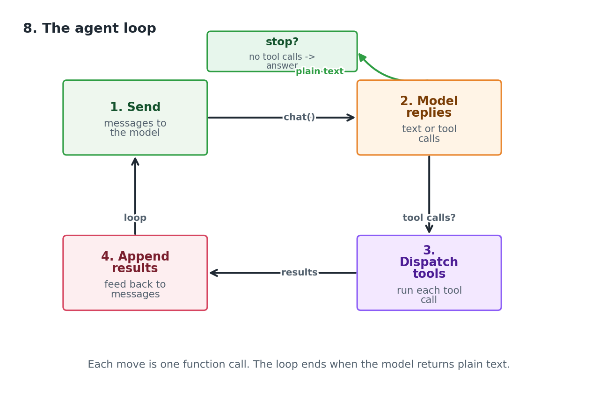
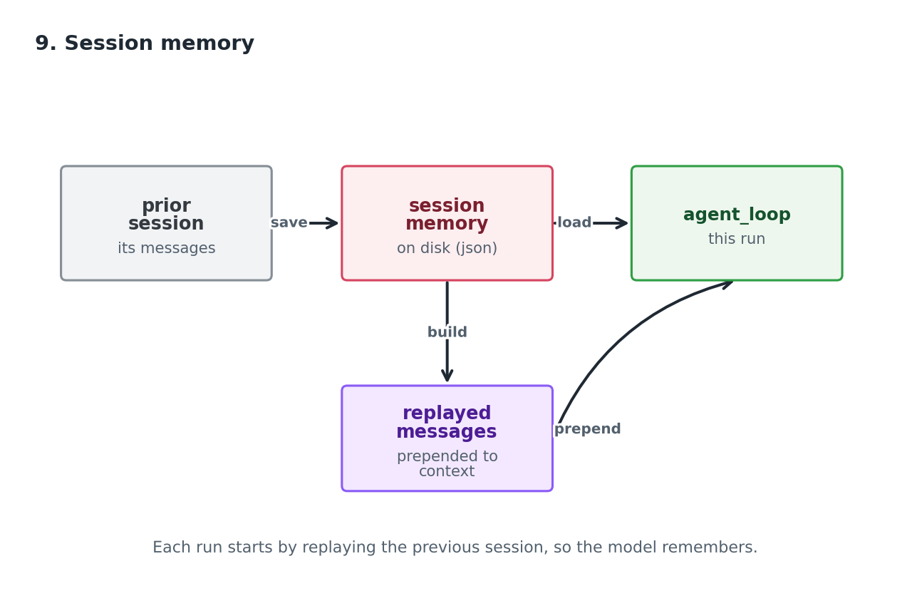

# baby-onit, Explained

*A teaching narrative for the `baby_onit.py` codebase — a ~1,200-line, single-file
agent harness distilled from [onit](https://github.com/sibyl-oracles/onit).*

---

## 0. Why a "baby" version exists

`onit` is a large, production agent system — roughly 60,000 lines across 104 files,
with terminal, web, and voice frontends, MCP servers, load balancers, and a
verification layer. That is far too much to learn from in one sitting.

`baby-onit` is the same *idea* reduced to the minimum that still works: one Python
file, one chat loop, a handful of tools, and a text UI. Every section header in the
source (`S1` … `S9`) names the concept it teaches and the `onit` file it came from,
so a reader can always walk from the toy to the real thing.

The whole program is one sentence:

> **The model proposes; the harness acts; repeat until the model stops proposing.**

Everything below is an unpacking of that sentence.

---

## 1. The big picture

There are only four moving parts, and they talk to each other in exactly one way.



- **You** hand the harness a task.
- The **harness** (`baby_onit.py`) wraps your task in a system prompt and sends the
  messages to the **model**.
- The model either answers in plain text (done) or emits a **tool call** — a JSON
  object naming a tool and its arguments.
- The harness runs that tool, appends the result as a new message, and sends the
  whole conversation back. The model decides what to do next.

Two properties fall out of this design and are worth internalising:

1. **The model never touches the machine.** It can only *ask* for a tool. The
   harness is the only thing that executes anything. This is the entire safety
   model of the program.
2. **The harness never talks to the model except through messages.** It is a
   dumb, faithful relay plus a set of guards. It does not "help" the model; it
   just runs what the model asked for and reports back.

---

## 2. One config dict (S1)

Every knob in the program lives in a single dictionary. `load_config` builds it by
deep-merging three sources, in order of increasing priority:

```
DEFAULTS  <-  ~/.baby-onit/config.yaml  <-  explicit --config path
```

`DEFAULTS` holds the sensible starting values:

| key | default | meaning |
|---|---|---|
| `serving.provider` | `auto` | which server family (auto-detects from host) |
| `serving.host` | `http://localhost:11434` | the model endpoint |
| `serving.model` | `""` | blank = auto-detect via `models.list()` |
| `serving.think` | `True` | route reasoning to its own field, not the answer |
| `serving.max_tokens` | `32768` | per-response cap |
| `serving.max_chat_iterations` | `-1` | turn cap; `-1` = unlimited |
| `serving.max_context_tokens` | `262144` | compaction trigger threshold |
| `data_path` | `~/baby-sandbox` | the agent's jail root |
| `enforce_jail` | `True` | confine file tools to `data_path` |
| `block_dangerous` | `True` | refuse `NEVER_ASK` commands in bash |

The deep merge matters: a partial `config.yaml` that only sets `serving.model`
keeps every other default. You never have to write a complete file.

> **Teaching point.** `onit` uses pydantic models over defaults for the same job.
> Here a plain recursive `merge` is enough because the schema is small and stable.

---

## 3. Secrets (S2)

The single most important rule in the harness:

> **Secrets never live in `config.yaml`.**

`config.yaml` may hold `host` and `model` — it may *not* hold a key. Keys are
resolved at runtime by `get_secret(name)`, which walks three tiers and returns the
first one that yields a value:



1. **Environment variable** — `BABY_ONIT_API_KEY` for endpoint keys, or
   `GITHUB_TOKEN`, `HF_TOKEN`, `OLLAMA_API_KEY`, `TAVILY_API_KEY` for the named
   services.
2. **OS keychain** — `keyring.get_password("baby-onit", name)`. The preferred
   at-rest store: encrypted by the OS, never a file on disk.
3. **0600 file** — `~/.baby-onit/secrets.yaml`. A fallback for machines without a
   keychain; mode `0600` so only the owner can read it.

Because the resolver is a single expression —
`env or keyring(name) or file_secrets().get(name)` — a secret can be supplied in
exactly one place and the rest of the code never knows which one it came from.
The setup wizard (`S9`) writes keys into the keychain (or the file), so after a
one-time `baby-onit setup`, `baby-onit chat` needs **zero flags**.

> **Teaching point.** This is the same "secrets are a runtime concern, not a config
> concern" split that `onit` makes, just with a smaller tier list.

---

## 4. One chat call, many servers (S3)

The `Provider` class is the abstraction that lets the same loop talk to Ollama,
vLLM, SGLang, OpenRouter, Vercel, OpenAI, or Claude. The trick is that almost all
of them speak the **OpenAI-compatible** protocol, so one `chat()` method covers
them; Ollama is the one odd one out with a native API, and the `gpt-6` family is
the other odd one out needing `/v1/responses` instead of `/v1/chat/completions`.

A few small helpers keep the surface area honest:

- `is_ollama_host(host)` — sniff the URL to pick the native path.
- `normalize_host(host, ollama)` — strip a trailing `/v1` or `/chat/completions`
  so either spelling in `config.yaml` works.
- `_is_openai_responses_model(model)` — route the `gpt-6` family to the responses
  API, because `/v1/chat/completions` refuses its tool calls.

`chat(messages, tools, stream_cb)` is the only method the loop ever calls. It
returns `(assistant_message_dict, usage_dict)`, and an optional `stream_cb` lets
the UI paint tokens as they arrive. The provider also remembers the chosen model
per endpoint in `~/.baby-onit/models.yaml`, so switching endpoints in the REPL
prefills the right model automatically.

> **Teaching point.** The loop is written against `Provider`, never against
> `openai` or `ollama`. That is what makes "any endpoint" a one-line config change
> rather than a code change.

---

## 5. The system prompt is the constitution (S4)

`SYSTEM_PROMPT` is a single string with two format holes — `{data_path}` and
`{today}` — filled by `build_system_prompt`. It is the one place where the harness
tells the model *how to behave*, and it does four jobs:

1. **Identity** — "You are baby-onit, a helpful AI agent that completes tasks by
   calling tools."
2. **Working directory** — every file path the model writes starts at
   `data_path`. This is the jail, stated in words.
3. **Tool routing** — a short decision table: files in the working directory go to
   `read_file` / `grep` / `search_document`; public facts and news go to web
   search; anything that can change (prices, versions, dates) needs a tool result,
   never memory; prefer the primary source.
4. **Credentials, pre-wired** — the harness authenticates git via `GIT_ASKPASS` and
   puts `HF_TOKEN` in the bash environment, so the model is told: *never hunt for a
   token or put one in a URL.*

That last point is a deliberate safety posture. The model is **told** the
credentials exist and are handled, so it has no reason to try to read or print
them — and the harness is the only component that actually holds them.

> **Teaching point.** In a real agent, the system prompt is policy. Changing one
> line here changes what the agent is allowed to do. `onit` keeps this policy in a
> separate module; here it is a constant because there is exactly one policy.

---

## 6. Tools (S5)

A tool is a **plain Python function with a JSON-schema business card**. The model
sees only the card (name, description, parameter schema); it never sees the code.

The harness ships eight:

| tool | what it does | guard |
|---|---|---|
| `web_search` | DuckDuckGo/Tavily web or news search | — |
| `fetch_content` | pull a URL, extract text/media | — |
| `bash` | run a shell command in the jail | `NEVER_ASK_COMMANDS` blocklist |
| `write_file` | create/append a file | jail path check |
| `read_file` | read a file (text/tables/images) | jail path check |
| `edit_file` | exact string replace in a file | jail path check |
| `local_search` | BM25 search over local docs | — |
| `search_document` | search within one document | jail path check |
| `grep` | regex search across files | jail path check; match/byte/line caps |

Three design details are worth studying.

**The bash jail.** `_resolve(path)` pins every path to `DATA_PATH` and refuses
anything that escapes it (when `enforce_jail` is on). Separately, `bash` refuses a
frozen set of `NEVER_ASK_COMMANDS` — the "become someone else / leave the machine"
executables (`sudo`, `docker`, `ssh`, `systemctl`, `shutdown`, …). This is the same
set `onit` refuses as `CRITICAL` without asking. The comment in the source makes the
distinction explicit: reaching for one of these is a *different kind of event* from
reaching for a linter nobody listed.

**`local_search` is the only nontrivial tool left in.** It is a complete retrieval
pipeline in about 80 lines: chunk → index → rank.



- `_chunks` splits text on blank lines into paragraph-aware chunks with overlap
  (the same defaults `onit` uses).
- `_tokens` lowercases, extracts alphanumerics, and drops a small stop-word set.
- The index is a plain in-memory BM25 table — no embeddings, so it works offline on
  any corpus.
- `tool_local_search` ranks the query tokens against every chunk and returns the
  top-k sections.

> **Teaching point.** A tool's *interface* is the schema; its *implementation* is
> an implementation detail the model never sees. You can rewrite `local_search`
> with embeddings and the loop does not change at all.

---

## 7. Registry and dispatch (S6)

The model emits tool calls as JSON. The harness has to turn that JSON into a real
function call, safely. `dispatch(name, args)` is that bridge, and it is the most
defensive function in the file.



1. **Unknown tool?** → return an error string listing what *is* available. The loop
   never crashes on a hallucinated tool name.
2. **Malformed args?** → run them through `json_repair` (the model sometimes emits
   slightly broken JSON). If that fails, return an error, not an exception.
3. **Type coercion** → `_coerce_args` reads the function's type hints and casts
   `"5"` → `5`, `"true"` → `True`, etc. Models are loose about types; the harness is
   not.
4. **Repeated-call guard** → a `(name, args)` that has already run returns the
   cached result instead of re-running, so a stuck model can't burn the turn budget
   on the same call.
5. **`NEVER_ASK` guard** → for `bash`, the blocklist is enforced here too.

The result of every tool is a **string**, wrapped by `_tool_message` into a
`tool`-role message and appended to the conversation. Read-only tools may run in
parallel; mutating ones run serially — a small but important distinction the loop
makes.

> **Teaching point.** Dispatch is where "the model proposes" meets "the harness
> acts." Every failure mode (bad name, bad JSON, wrong type, repeat, forbidden
> command) is handled by returning a *message* the model can read, never by raising
> an exception that kills the loop.

---

## 8. The agent loop (S7)

`agent_loop` is the heart of the program, and it is a `while True` with four moves.



```
messages = [system] + replayed_session + [user: task]
while True:
    1. send messages to the model            (provider.chat)
    2. if the reply has tool calls: run them (dispatch, parallel/serial)
    3. append the results as tool messages
    4. if no tool calls -> the reply is the answer; stop
       (or stop on the iteration cap)
```

The loop also enforces two limits:

- **Iteration cap** — `max_chat_iterations`; `-1` means unlimited, matching `onit`.
- **Context compaction** — when the estimated prompt size approaches
  `max_context_tokens`, older turns are summarised so the conversation fits.
  The check runs before each request, on a fresh estimate, because the
  provider's reported token count cannot see the tool results just appended.
- **Tool-result cap** — every tool result is clamped to `TOOL_RESULT_MAX_CHARS`
  (40 000) on its way into the transcript. `grep` is additionally bounded by
  match count, total bytes, and per-line length: a match count alone says
  nothing about size, and a single minified-JSON or base64 line can be
  megabytes.

The loop returns the final assistant text. It takes an `on_event(kind, text)`
callback so the UI can render each step live, but the loop itself knows nothing
about screens — it just emits events.

> **Teaching point.** The loop is deliberately *dumb*. It has no policy, no
> intelligence, no "helping." It relays messages, runs tools, and stops. All the
> intelligence is in the model; all the safety is in the guards around it.

---

## 9. Session memory (S7.5)

In the REPL, every line you type is a **fresh** `agent_loop` call. A fresh call has
no memory of the previous line — so the harness gives it some.

`build_session_messages` replays the prior conversation: each stored
`{task, response}` pair becomes a `user` message plus an `assistant` message,
oldest first, and those are prepended to the current task.



Because a long session would blow the context budget, `_trim_history` keeps the
most recent turns in full and head-trims the older ones (answer bodies cut to a
short head, questions kept whole). The result is a conversation that is *almost*
the full history but bounded in size.

> **Teaching point.** This is a cheap stand-in for real memory. `onit` persists
> sessions and can resume them across processes; here the history lives in a
> `history.jsonl` file and is replayed in-process. Same idea, smaller footprint.

---

## 10. The text UI (S8)

The UI is a **one-way display**: it renders loop events for the human and never
talks back to the model. It is built on `rich` (panels, tables, syntax highlighting)
and does three things:

- **Banner** — host, model, working directory, and tool count at startup.
- **Live rendering** — each `on_event` is painted: streamed tokens, tool calls,
  tool results, and the final answer.
- **REPL** — a prompt with line history, plus a few backslash commands
  (`\reset` to clear session memory, `\clear` to drop the current endpoint config,
  `\model` to switch models, etc.).

The strict one-way rule is the point: the UI can be replaced by a web frontend, a
voice frontend, or nothing at all, and the loop does not change. That is exactly the
separation `onit` makes between its many frontends and its core.

---

## 11. doctor (S8.9)

`doctor` answers one practical question: *"which of my endpoints actually work
right now?"* It takes **one minimal task** and runs it against **every known
endpoint** in parallel, each probe bounded at 20 seconds, and streams the results
into a table as they land.

Each row shows the host, the key (masked to its last four chars), the model, a
status (`ok` / `no key` / `offline` / `error`), a short answer or error, the model
latency, and the prompt-token count. The footer summarises `n/total endpoints ok`
and lists each failure with its error.

> **Teaching point.** `doctor` reuses the exact same `Provider` and `chat` path the
> loop uses — it is not a separate health-check implementation. If `doctor` works,
> `chat` works. That reuse is the whole value of the `Provider` abstraction.

---

## 12. setup (S9)

`setup` is the on-ramp: a wizard that writes `config.yaml` and stores secrets so
that `chat` needs zero flags afterwards. It:

1. Lets you pick an endpoint (a preset, the current one, or a custom URL) and
   validates that it is an `http://`/`https://` URL.
2. Asks for the API key via `getpass` (never echoed), and stores it with
   `set_secret("endpoint_key:<host>", key)` — into the keychain, or the 0600 file.
3. Auto-detects a model via `models.list()` (or lets you type one) and remembers it
   per endpoint in `models.yaml`.
4. Offers to delete an endpoint's stored config (`forget_endpoint`) when you switch.

The CLI itself is a small `argparse` tree: `setup`, `chat`, `run "task"`, `doctor`,
plus flags like `--host`, `--model`, `--data-path`, `--no-think`,
`--max-iterations`, `--max-context-tokens`, and `--config`.

> **Teaching point.** Setup is the only place that *writes* secrets. Everything
> else only *reads* them through `get_secret`. That single-writer rule is what keeps
> the three-tier resolver honest.

---

## 13. From toy to real

`baby-onit` is a distillation, and the distillation is the lesson. Each section
header points at the `onit` file it came from, so the path from ~1,200 lines to
~60,000 is a straight line:

| baby-onit (one file) | onit (104 files) |
|---|---|
| `DEFAULTS` + `merge` | pydantic models over defaults |
| `get_secret` (env/keychain/file) | a full secrets service |
| `Provider` (one `chat`) | per-provider adapters + load balancing |
| `SYSTEM_PROMPT` constant | a policy module |
| `NEVER_ASK_COMMANDS` set | `command_policy.py` with severity tiers |
| `agent_loop` while-loop | a supervised loop with verification |
| `history.jsonl` replay | persistent, resumable sessions |
| `rich` text UI | terminal / web / voice / A2A frontends |
| `local_search` BM25 | BM25 + dense retrieval, fused |

The core idea survives the distillation intact: **a model that can only propose, a
harness that can only act, and a loop that passes messages between them.** Learn
that loop in one file, and the rest of `onit` is just scale.

---

*Generated from `baby_onit.py` (sections S0–S9). Diagrams in `_figs/`.*
